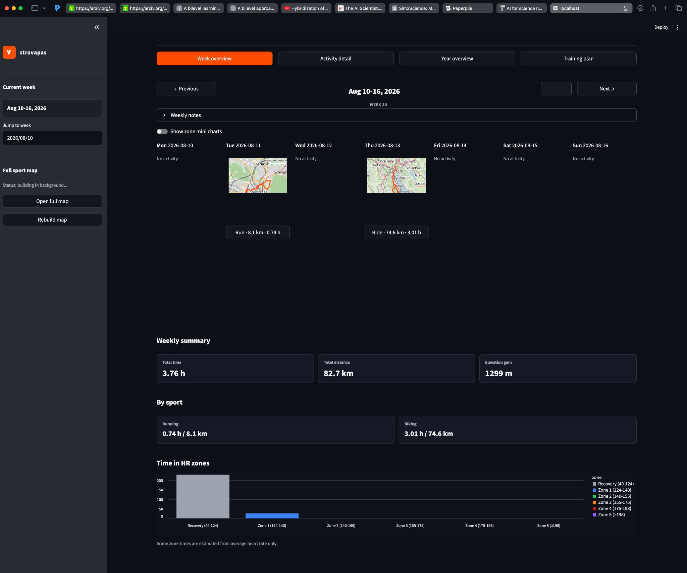
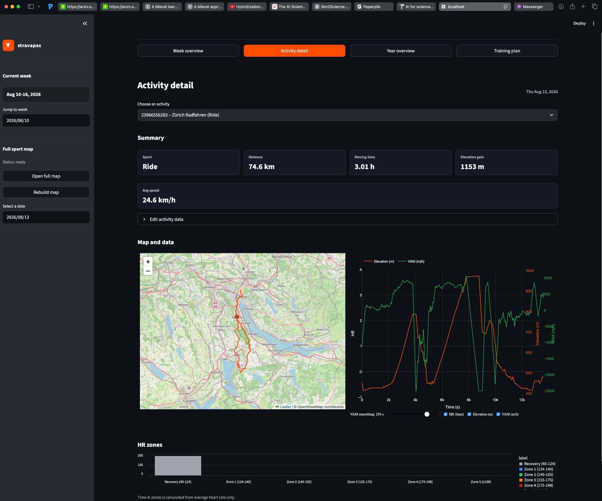
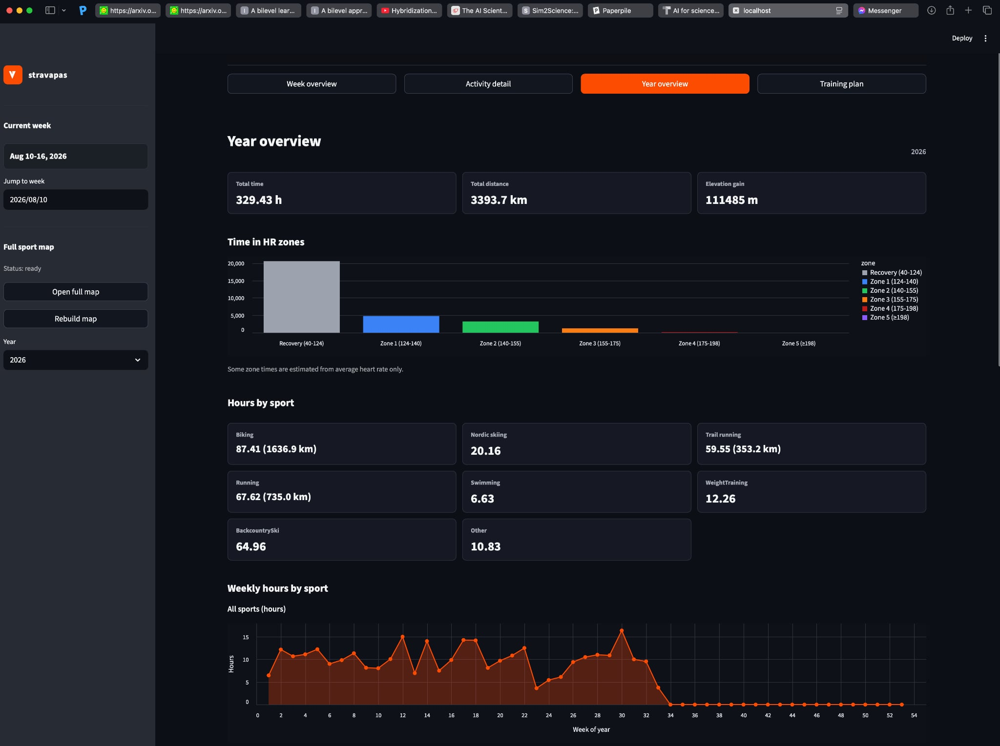
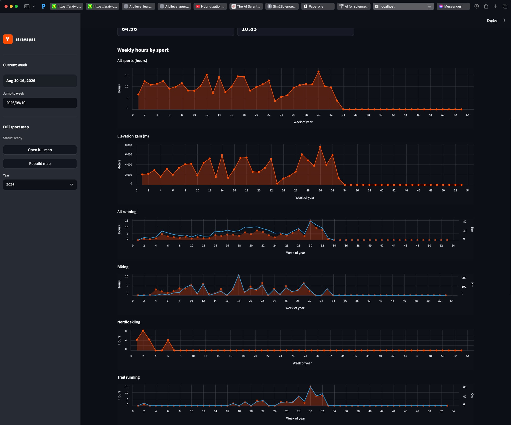

# stravapas

A local-first Streamlit dashboard for turning Garmin and historical Strava data
into a clear view of training load, routes, heart-rate zones, and progress over
time.

<p align="center">
  
</p>

## What it does

- **Weekly overview** — browse week by week, see route previews, totals by sport,
  elevation gain, heart-rate-zone distribution, and weekly notes.
- **Activity detail** — inspect distance, time, speed, elevation, heart rate,
  power, cadence, and a hover-linked route and telemetry chart.
- **Year overview** — compare annual totals, time in HR zones, sport-specific
  volume, distance, and elevation trends by ISO week.
- **Training plan** — review and edit a CSV-based plan, including weekly phases,
  sessions, target hours, intensity, and vertical targets.
- **Full sport map** — build a layered Folium map from cached GPX tracks in the
  background without blocking the dashboard.
- **Editable local data** — add manual activities, correct activity fields, and
  keep per-activity or per-week notes without modifying the source exports.
- **Incremental sync** — refresh recent Garmin activities and cache GPX, heart
  rate, and power data locally.

## Screenshots

### Activity detail



<details>
<summary><strong>Year overview and weekly trends</strong></summary>





</details>

## Quick start

Python 3.10 or newer is required.

```bash
python -m venv .venv
source .venv/bin/activate
python -m pip install --upgrade pip
python -m pip install streamlit pandas altair folium gpxpy requests \
  garminconnect curl_cffi fitparse
```

Authenticate with Garmin Connect. On the first run, either use an interactive
terminal and enter credentials when prompted, or provide them as environment
variables:

```bash
export GARMIN_EMAIL="you@example.com"
export GARMIN_PASSWORD="your-password"
```

Authentication tokens are cached by `garminconnect` in `~/.garminconnect` by
default. Set `GARMINTOKENS` to use another token directory.

Fetch the latest data and start the dashboard:

```bash
python daily_sync.py
streamlit run app.py
```

The app also attempts one incremental sync when a new Streamlit session starts.
If a local dataset already exists, the dashboard remains usable when that sync
cannot connect.

## Data sources

The normalized activity table combines two sources at a fixed cutover date:

- activities before **2026-06-30** come from `strava_activities.json`;
- activities on and after **2026-06-30** come from `garmin_activities.json`.

`build_table.py` normalizes both exports into `activities_clean.csv` and removes
duplicate activity IDs. If you do not need historical Strava data, the Garmin
source can be used on its own.

To import historical Strava activities, configure `STRAVA_CLIENT_ID`,
`STRAVA_CLIENT_SECRET`, and a one-time `STRAVA_AUTH_CODE`, then run:

```bash
python strava_auth.py
python strava_fetch.py
python build_table.py
```

Never commit `strava_client.json`, `strava_tokens.json`, Garmin tokens, or raw
activity exports from a private account.

## Daily workflow

```bash
python daily_sync.py
```

The sync pipeline:

1. refreshes a rolling window of recent Garmin activities;
2. rebuilds the combined activity table;
3. exports and caches GPX tracks;
4. caches heart-rate and power streams; and
5. records the last successful sync in `sync_state.json`.

Cached files are reused, so subsequent runs only fill missing or newly available
data. To inspect Garmin payload and stream availability without running the full
dashboard, use:

```bash
python garmin_probe.py --limit 10
# or inspect one activity
python garmin_probe.py --activity-id ACTIVITY_ID
```

## Local files

| Path | Purpose |
| --- | --- |
| `activities_clean.csv` | Normalized activity table used by the app |
| `gpx/activity_<id>.gpx` | Cached route data |
| `hr_streams/hr_stream_<id>.csv` | Cached heart-rate samples |
| `power_streams/power_stream_<id>.csv` | Cached power samples |
| `activity_overrides.json` | Local corrections and activity notes |
| `manual_activities.json` | Activities entered in the dashboard |
| `weekly_notes.json` | Notes attached to ISO weeks |
| `hr_zones.json` | Optional heart-rate-zone configuration |
| `hm_to_kima_workout_plan.csv` | Training-plan source edited by the app |
| `gpx_sport_map.html` | Generated full-map artifact |
| `year_overview_cache/` | Cached annual summaries |

Most generated caches and all JSON files are ignored by Git. Review staged files
carefully before publishing: activity exports, maps, routes, screenshots, and
training notes can reveal sensitive health or location information.

## Useful commands

```bash
# Fetch Garmin activities and rebuild only the normalized table
python garmin_fetch.py
python build_table.py

# Rebuild the standalone full sport map
python build_gpx_map.py

# Launch the dashboard
streamlit run app.py
```

## Tech stack

The dashboard is built with Streamlit and Altair, uses Pandas for normalization
and aggregation, and renders route data with Folium, Leaflet, Plotly, and GPXPy.
